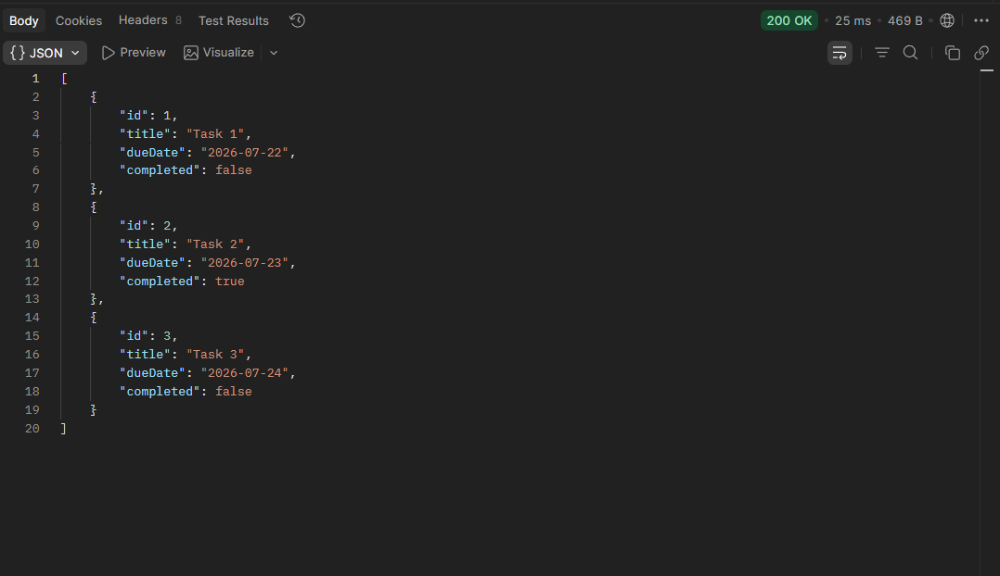
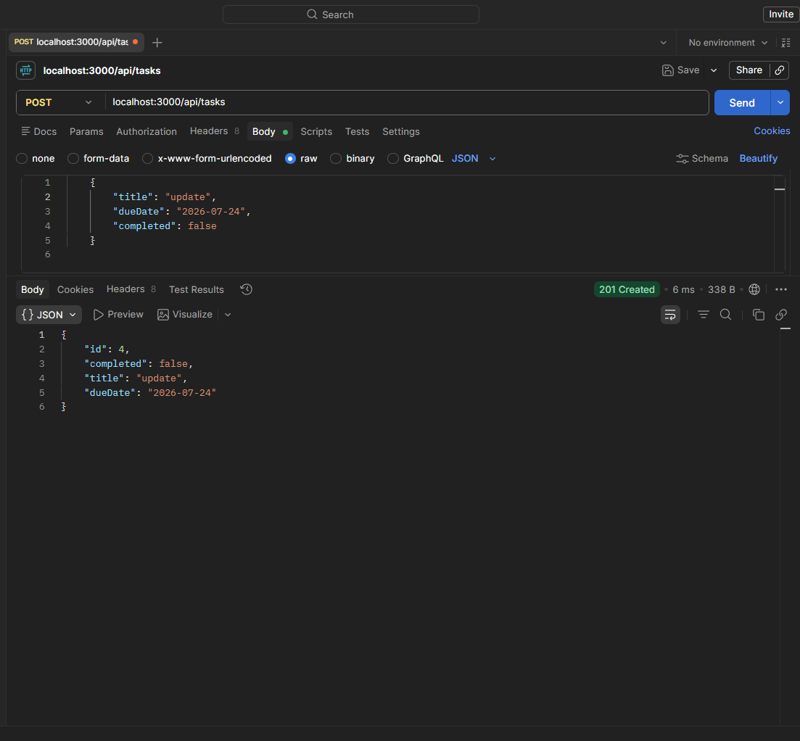

# itelect2-project
My IT Elective 2 backend web development project.

# API Testing Results

This area contains the results of API Testing. 

---

## GET Request

### Retrieve All Records
The API successfully retrieves all available records.

### Retrieve a Record by ID
The API successfully retrieves the specified record using its ID.

---

## POST Request

### Create a New Record
The API successfully creates a new record and stores it in the database.

### Verify Created Record
The newly created record is successfully retrieved using a GET request.

### Error Handling
The API correctly returns an error response when invalid or incomplete data is submitted.

---

## PUT Request

### Update an Existing Record
The API successfully updates the specified record.

### Verify Updated Record
The updated information is successfully retrieved using a GET request.

### Error Handling
The API correctly returns an error response when attempting to update a record with invalid data or a non-existent ID.

---

## DELETE Request

### Delete an Existing Record
The API successfully deletes the specified record.

### Verify Deletion
A subsequent GET request confirms that the record has been removed.

### Error Handling
The API correctly returns an error response when attempting to delete a record that does not exist or when an invalid request is made.

